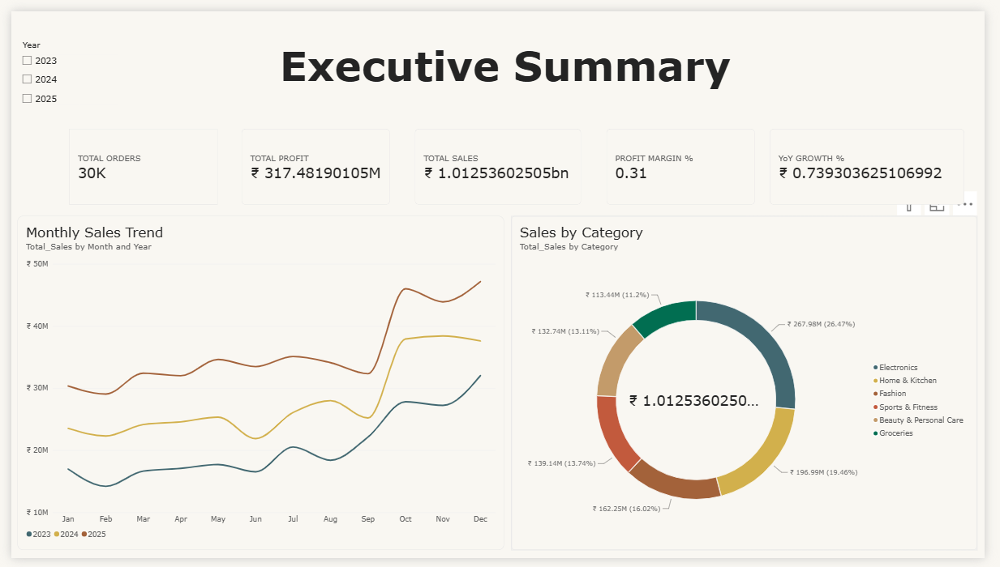
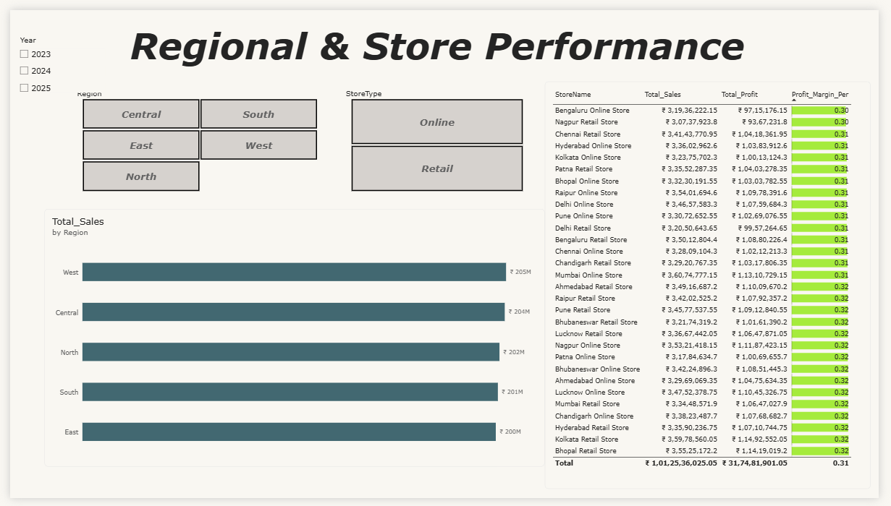
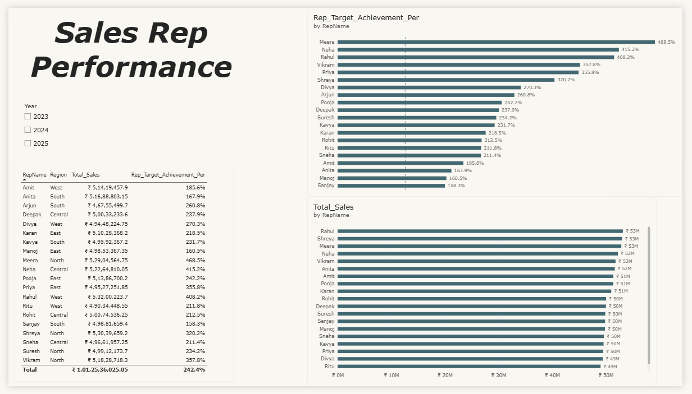
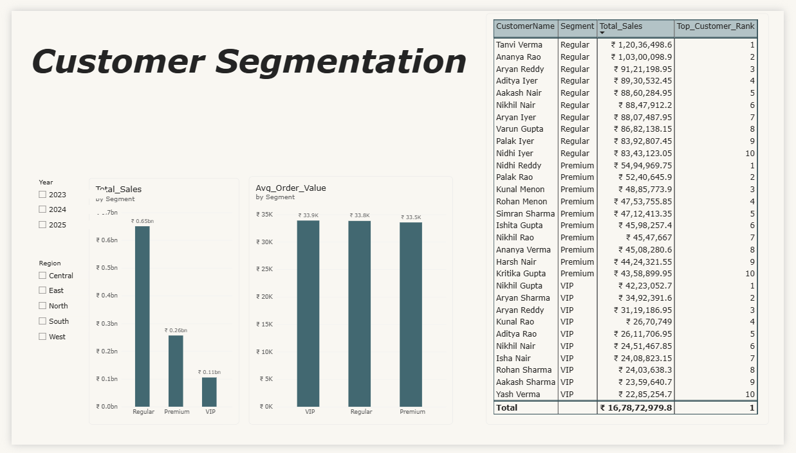

# Retail Sales Intelligence Dashboard (Power BI)

Interactive Power BI dashboard analyzing 3 years of multi-region retail sales — built to answer
a real business question: *which regions, categories, and reps are driving performance, and
where is the business leaving money on the table?*

## Business Problem

A multi-region retail chain (30 stores across 5 regions, ~30,000 transactions, 2023–2025) needed
leadership visibility into regional/category performance, sales-rep target achievement, and
customer-segment profitability to guide staffing and inventory decisions.

## Data Model

Star schema with one fact table and five dimension tables, modeled and related in Power BI:

- **Fact_Sales** (~30,000 rows) — transaction-level Quantity, Discount %, Net Amount, Profit
- **Dim_Date** — marked date table (2023–2025) for time intelligence
- **Dim_Product** — 84 SKUs across 6 categories
- **Dim_Store** — 30 stores across 5 regions (Retail + Online)
- **Dim_SalesRep** — 20 reps with monthly revenue targets
- **Dim_Customer** — 800 customers segmented Regular / Premium / VIP

Raw data was cleaned in Power Query first (duplicate transaction IDs removed, blank discount
values handled) before the model and measures were built.

## Tools Used

Power BI Desktop · Power Query (M) · DAX · Excel (source data)

## Key DAX Measures

```dax
Total Sales = SUM(Fact_Sales[NetAmount])
Profit Margin % = DIVIDE([Total Profit], [Total Sales], 0)
YoY Growth % = DIVIDE([Total Sales] - [Sales LY], [Sales LY], 0)
Rep Target Achievement % = DIVIDE([Total Sales], SUM(Dim_SalesRep[MonthlyTargetINR]) * 36, 0)
Top Customer Rank = RANKX(ALL(Dim_Customer[CustomerName]), [Total Sales])
```

*(Target Achievement % uses a simplified 36-month window assumption over the full dataset —
noted here for transparency rather than presented as a precise KPI.)*

## Key Insights

- **Total Sales: ~₹101.25 crore** | **Profit Margin: ~31.35%**
- **October is the peak sales month** across all three years — a clear seasonal spike worth
  planning inventory and staffing around ahead of time.
- Sales-rep revenue is concentrated in a fairly narrow band (~₹49M–₹53M per rep), but calculated
  target achievement varies far more widely — from **~158% (Sanjay, lowest)** to **~469%
  (Meera, highest)** — suggesting individual monthly targets may be miscalibrated relative to
  actual rep workload, not just a performance gap.

## Dashboard Pages

| Page | Focus |
|---|---|
| Executive Summary | Total sales/profit KPIs, monthly trend, category split |
| Regional & Store Performance | Sales/profit by region and store, with margin conditional formatting |
| Sales Rep Performance | Rep-level sales and target achievement |
| Customer Segmentation | Sales by segment, top customers, average order value |

### Screenshots






## Repository Contents

- `Retail_Sales_Dashboard.pbix` — the Power BI file
- `data/Retail_Sales_PowerBI_Dataset.xlsx` — source dataset (star schema, 6 sheets)
- `screenshots/` — dashboard page exports

## Author

Ninaniya Nateesh Kumar — [LinkedIn](https://linkedin.com/in/nateesh) ·
[GitHub](https://github.com/Nateesh-Kumar)
